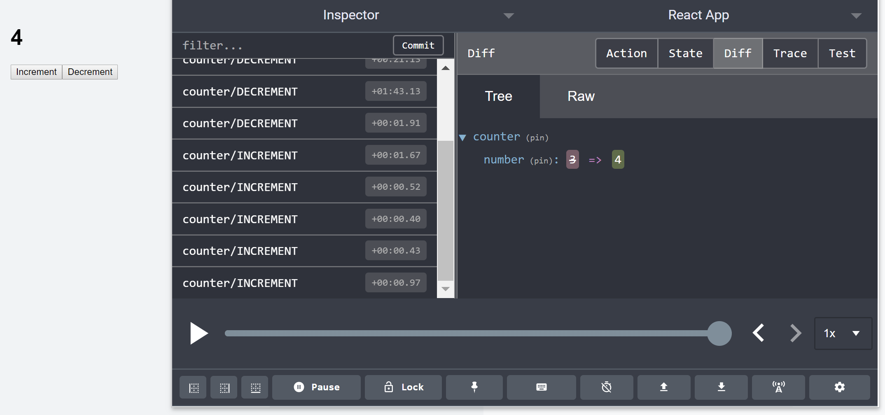

# Counter - React Redux

This app shows the counter, the number increment and decrement, to practice React Redux.

To handle the counter number, this is used Redux Actions.

> Redux Actions 

 
<b> 1. install </b>
       
       npm install --save redux-actions

<b> 2. createActions </b>

Wraps an action creator so that its return value is the payload of a Flux Standard Action.

- createAction(type) 

- createAction(type, payloadCreator) 

- createAction(type, payloadCreator, metaCreator)

Calling createAction with a type will return an action creator for dispatching actions. 

'type' must implement toString and is the only required parameter for createAction.

      export const increment = createAction('INCREMENT');
      export const decrement = createAction('DECREMENT');

      increment(10); // { type: 'INCREMENT', payload: 10 }
      decrement([1, 42]); // { type: 'DECREMENT', payload: [1, 42] }
      
<b> 3. handleActions </b>
      
Wraps a reducer so that it only handles Flux Standard Actions of a certain type.

- handleAction(type, reducer, defaultState)

- handleAction(type, reducerMap, defaultState)

      handleAction(
        'APP/COUNTER/INCREMENT',
        (state, action) => ({
          counter: state.counter + action.payload.amount
        }),
        defaultState
      );
      
<b> 4. combineActions </b>

Combine any number of action types or action creators. 

'types' is a list of positional arguments which can be action type strings, symbols, or action creators.

- combineActions(...types)

<b> 5. Example for usage all actions </b>

            import { createActions, handleActions, combineActions } from 'redux-actions';

            const defaultState = { counter: 10 };

            const { increment, decrement } = createActions({
              INCREMENT: (amount = 1) => ({ amount }),
              DECREMENT: (amount = 1) => ({ amount: -amount })
            });

            const reducer = handleActions(
              {
                [combineActions(increment, decrement)]: (
                  state,
                  { payload: { amount } }
                ) => {
                  return { ...state, counter: state.counter + amount };
                }
              },
              defaultState
            );

            export default reducer;

> This counter app is used createAction and handleAction in src/store/modules/counter.js

For state of counter, can use handleAction instead of switch.
      
        // If use switch, do action according to action type; increment and decrement
 
        export default function reducer(state = initialState, action){

          // return state 
          switch (action.type) {
            
            case INCREMENT:
              return {number: state.number + 1};
              break;

            case DECREMENT:
              return {number: state.number - 1};
              break;

            default:
              return state;

          }
        }

       // If use handleAction
       
        import { createAction, handleAction } from 'redux-actions';
        
        ...
        
        export const increment = createAction(INCREMENT);
        export const decrement = createAction(DECREMENT);

        const initialState = {
          number:0
        };

        export default handleActions({
          [INCREMENT]: (state, action) => {
            return { number: state.number + 1 };
          }, 
          [DECREMENT]: (state, action) => {
            return { number: state.number - 1 };
          } 
        }, initialState);

> Show the app with DevTools of Chrome

